[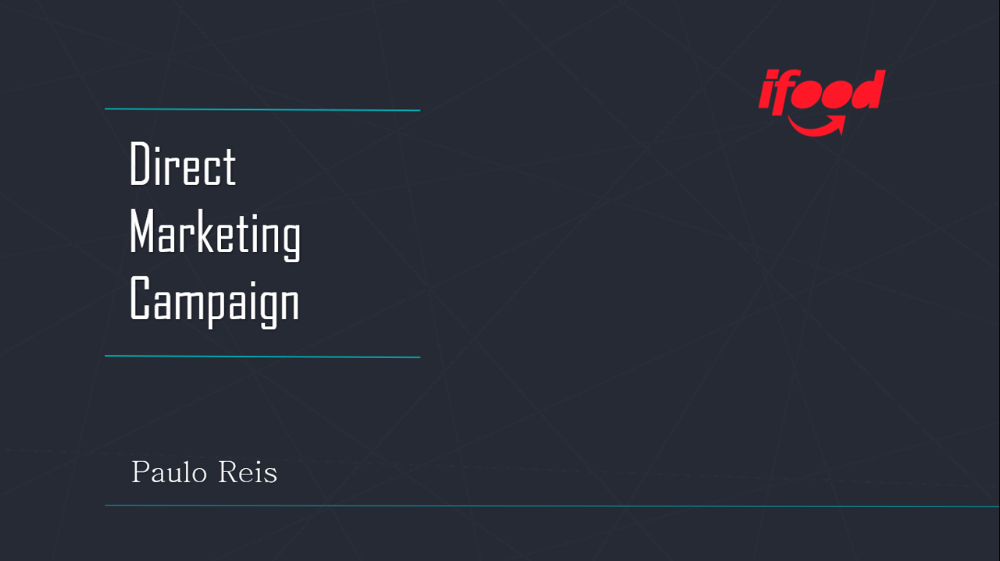](https://github.com/pauloreis-ds/ifood_marketing_campaign/tree/main/ifood_marketing_campaign/presentation)

[PowerPoint Presentation](https://github.com/pauloreis-ds/ifood_marketing_campaign/tree/main/ifood_marketing_campaign/presentation)

Full Case: https://github.com/ifood/ifood-data-business-analyst-test

[Dataset.](https://www.kaggle.com/paulosabinoreis/ifood-customer-dataset) 

**Notebooks:** 
[Analysis](https://nbviewer.jupyter.org/github/pauloreis-ds/ifood_marketing_campaign/blob/main/ifood_marketing_campaign/pr_v01_ifood_marketing_campaign.ipynb) 
[Customer Classification](https://nbviewer.jupyter.org/github/pauloreis-ds/ifood_marketing_campaign/blob/main/ifood_marketing_campaign/pr_v01_ml_ifood_marketing_campaign.ipynb) 
[Customer Segmentation (Clustering)](https://nbviewer.jupyter.org/github/pauloreis-ds/ifood_marketing_campaign/blob/main/ifood_marketing_campaign/pr_v01_ml_cluster_ifood_marketing.ipynb) 

**Agenda**
1. Context
2. [Business Impact](#Business-Impact)
    * [Predictive Model](#Predictive-Model)
    * [Cluster Analysis](#Cluster-Analysis)
    * [Data Analysis Insights](#Data-Analysis-Insights)
3. [Next Steps](Next-Steps)
        

  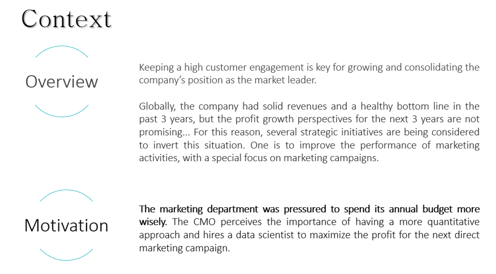

<b>It is your challenge to understand the data, find business opportunities & insights, and to propose any data-driven action to optimize the campaign’s results & generate value to the company.</b>

Perform robust exploratory analysis, using advanced analytics tools and statistical methods to generate data products to optimize business results (predictive & clusterization models, for example).
     
- Key Objectives and Deliverables are:
    1. <b>Explore the data</b> – be creative and pay attention to the details. You need to provide the marketing team a better understanding of the characteristic features of respondents; How do variables connect with response rates? What other relationships between variables are interesting for the business? Which actionable can we take out of the EDA?
    2. Propose and describe a <b>customer segmentation</b> based on customers’ behaviors; How many and which profiles are there in the database? How does segmentation connect to the campaign's financial return?
    3. Create a **predictive model** which allows the company to maximize the profit of the next marketing campaign. What is the best metric that correlates with the profitability of the campaign?     

 
## Business Impact

### Predictive Model

[Customer Classification Notebook](https://nbviewer.jupyter.org/github/pauloreis-ds/ifood_marketing_campaign/blob/main/ifood_marketing_campaign/pr_v01_ml_ifood_marketing_campaign.ipynb)

**Estimated Revenue for Next Campaign:**

> Worst Scenario: R\\$ 15,675.73  
> **Expected:       R\\$ 17,390.27**  
> Best Scenario:  R\\$ 19,104.80  
>
> ___
>
> _"The total cost of the sample campaign was 6.720MU and the revenue generated_
>
> _by the customers who accepted the offer was 3.674MU. Globally the campaign_
>
> _had a profit of -3.046MU. The success rate of the campaign was 15%."_

<b>The predictive model created has a precision of 71%. Which means that from those customers that the algorithm identifies as a potential acceptor of the offer, 71% of them will actually accept it. Thus, when using the model in the next campaign, We estimate a revenue that can vary from R\$ 15,600.00 to R\$ 19,100.00</b>

    With an increase on ROI that is very significant. 
    From -45% then to 158% now.

## Cluster Analysis

[Customer Segmentation Notebook](https://nbviewer.jupyter.org/github/pauloreis-ds/ifood_marketing_campaign/blob/main/ifood_marketing_campaign/pr_v01_ml_cluster_ifood_marketing.ipynb)

In the segmentation, I found 3 groups that I called

- **Targeted** - **They concentrate more of our targets**.
- **Untargeted** - Because they concentrate less of the customers targeted by the campaign, **this is a group that we want to avoid or work on other marketing strategies with them**.
- **Hidden Targets** - which in absolute numbers contain almost the same amount of targets than the Targeted group, but as they are more diluted and disguised together with other customers that are not of interest (at least not right now), until we investigate further this is a cluster that ends up being a black box.

The cluster of our interest we can see that they are the ones that spend the most on wine and have bought larger quantities of products. Which opens up a <b>Cross Selling opportunity</b> With the data of the transactions we could say which products would be the best complementaries, but with them unavailable at the moment I pass this task on to the business team.

<b>Our targets are those that spend the most per month, which strengthens the idea of cross selling.</b>

  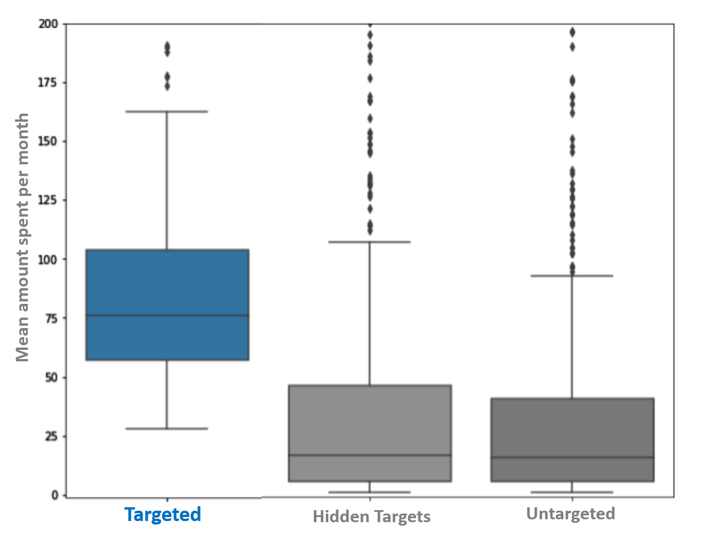

<b>They have higher expenses with wine and family income.</b>

  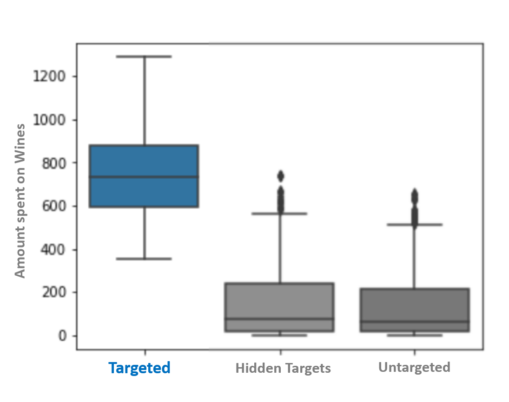

<b>And greater number of purchases.</b>

  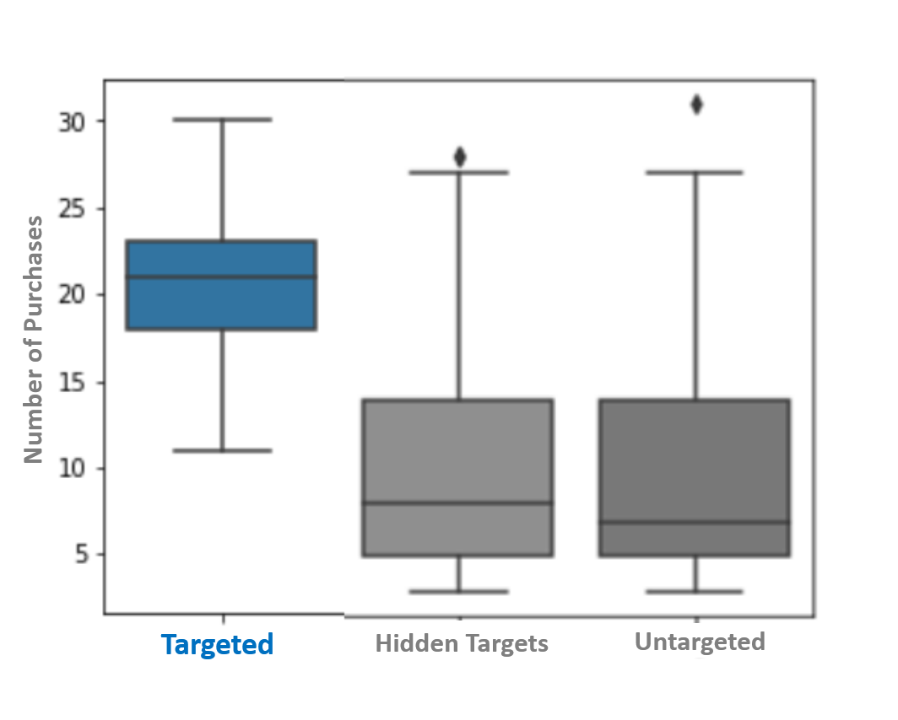

### Data Analysis Insights

[Analysis Notebook](https://nbviewer.jupyter.org/github/pauloreis-ds/ifood_marketing_campaign/blob/main/ifood_marketing_campaign/pr_v01_ifood_marketing_campaign.ipynb)

> Let's take a look at some of the results of the analysis with the insights, which I took from the hypotheses derived from this hypothesis map. The idea here is to generate this map based on the [4Ps](https://medium.com/ifood-tech/o-recheio-%C3%A9-contexto-e-relev%C3%A2ncia-488e58b30e2d) and the internal client's request. But being a case of recruitment and selection, I myself gave life to the business hypotheses to understand how the relationship in the data.

  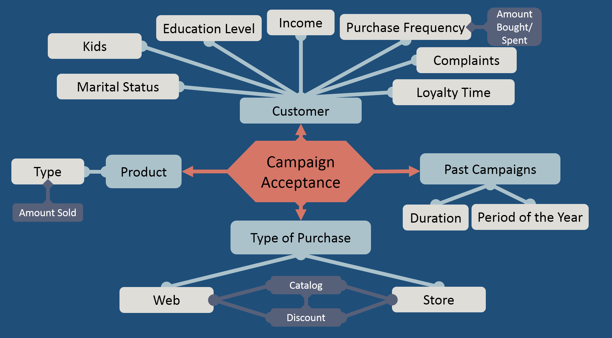

### What kind of product brings the most revenue? 

**Wine.**
     

    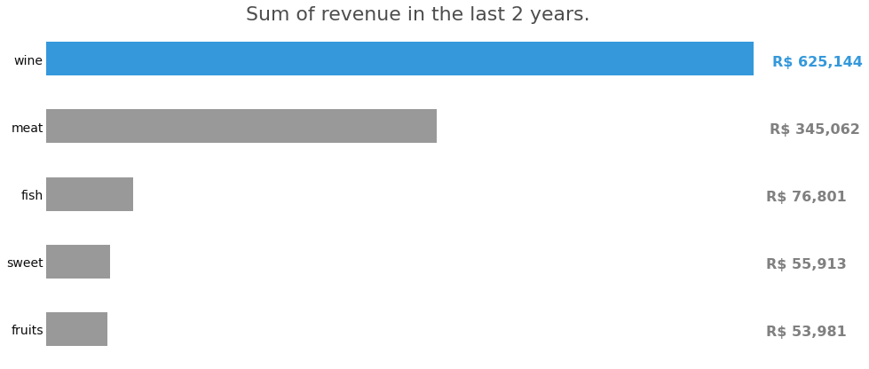

People use 50% of their spends on wine. As I mentioned earlier ... This could be a sign for a future campaign. <b>We can focus on making wine sales even stronger or raising the average ticket for other more profitable products</b>. Either way, we need more data to understand why this happens and to be more assertive about which way to go.

    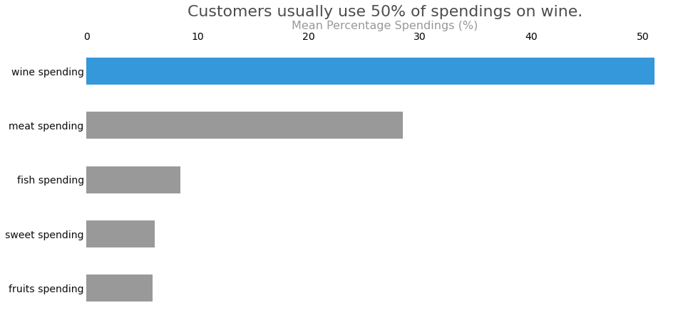

### Which sales channel brings the most revenue?

Physical stores have a higher number of purchases, so it is expected that they generate more revenue ... and yes, <b>44% (R\$ 37,400) of the revenue comes from stores</b>. ... and with a conversion rate of 77%, attracting people to the web platform appears to be a good investment.

        29% (R$ 24,650) of monthly estimated revenue comes from web and 27% (R$ 22,900) from catalog.

    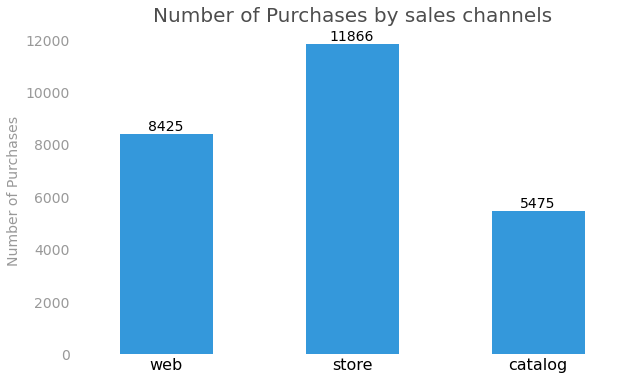

   
   

### Older Customers tend to accept the campaign.

**Yes, in the target campaign we can see that most customers who accepted the offer are subscribed for longer.**

    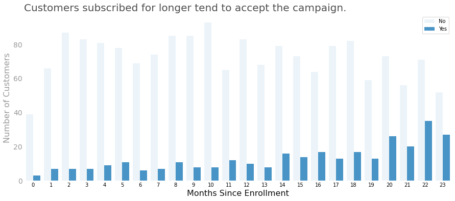

   
   
   
### Customers who buy more frequently tend to accept the campaign.

We don't have data about frequency of dates of purchases. Howerver...

    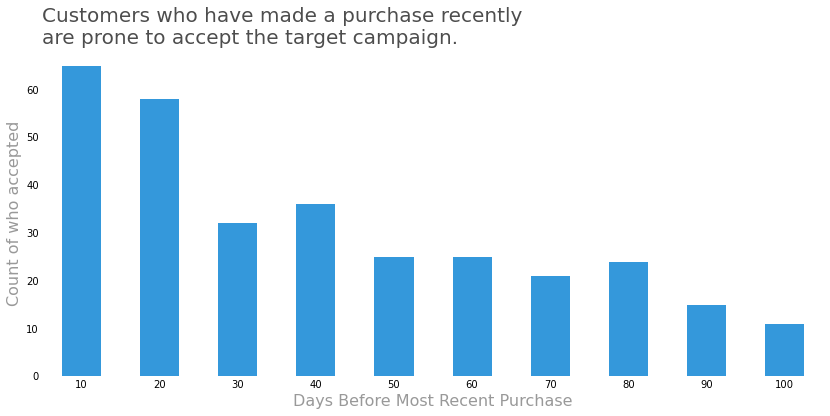

 
   
   
### Customers with higher income brings more revenue.

Yes. but this correlation is not as strong as expected, which means that in terms of revenue the difference may not be that large.

    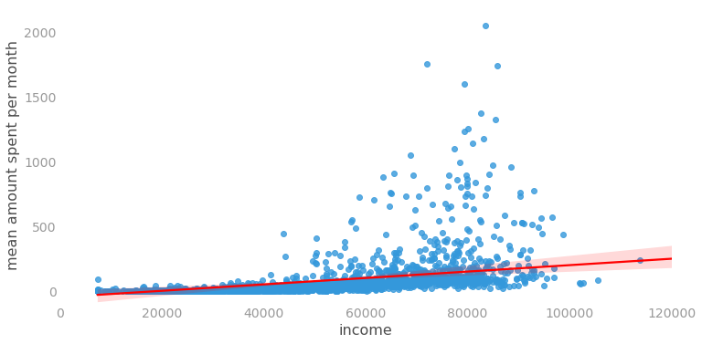

 
   
   
### Customers with greater educational level tend to accept the campaign.

(Yes, but) Not quite, since half of customers are graduated, then this imbalance in data kind of undo any possible trend.

    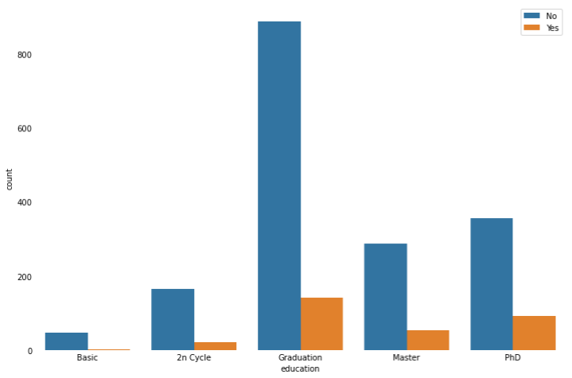

However, when using a percentage scale we can see there is a relation, but that doesn't mean the more the PHDs the higher the chance the client will accept the offer.

  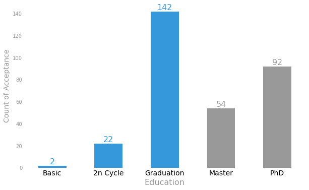
  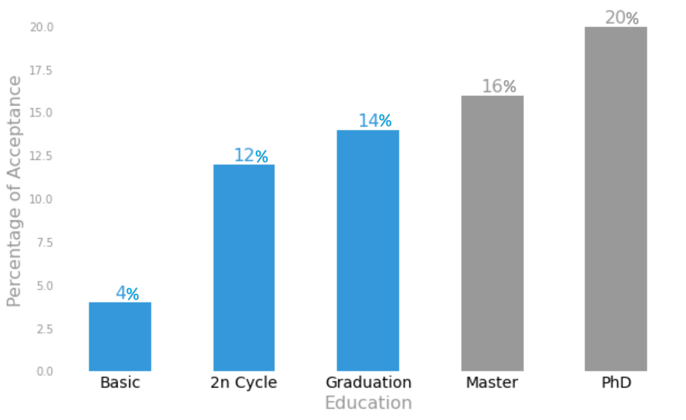

   
   

## Next Steps

Deeper Analysis of Clusters.

Study our targets behavior into each cluster.

Increase the numbers of clusters.

Outlier Analysis.

Recommendation System.

---
